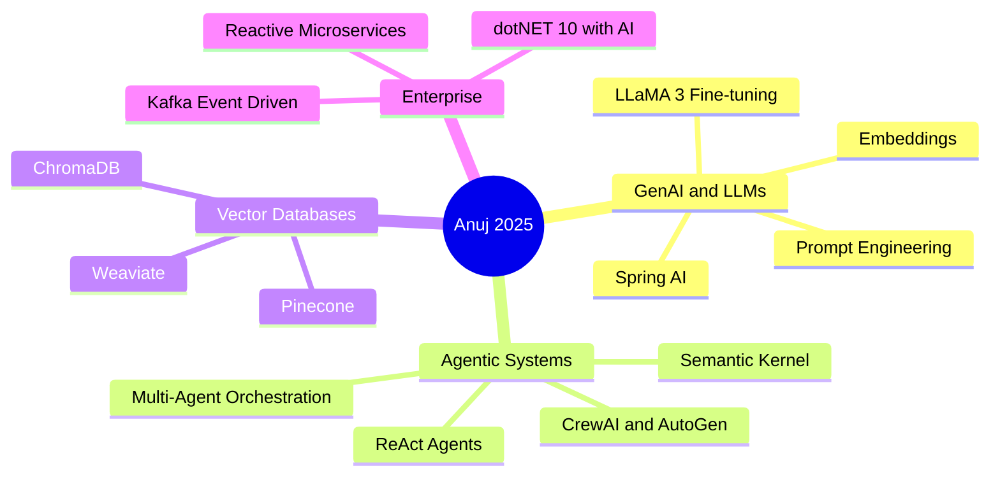

---

## 👨‍💻 About Me

| | |
|---|---|
| **Role** | Senior Full Stack and AI Engineer |
| **Company** | Axis Bank 2023-2025 then Freelance AI/ML 2025 to Present |
| **Location** | Meerut, Uttar Pradesh, India |
| **Experience** | 6+ Years in Enterprise Software Engineering |
| **Education** | BCA - CCS University |
| **Building** | Agentic AI, RAG Pipelines, Multi-Agent Systems |
| **Exploring** | LLaMA Fine-tuning, CrewAI, Semantic Kernel |
| **Phone** | +91 6395368063 |

> *"I don't just build applications — I engineer intelligent agents that scale with your business."*

---

## 🏆 GitHub Trophies

---

## ⚙️ Engineering Philosophy

| 🤖 Intelligent Automation | 🏗️ Scalable Architecture | 💼 Business Impact |
|:---:|:---:|:---:|
| Build **Agents** not just code. GenAI-powered automation for complex workflows | Battle-tested **Microservices** and **Event-Driven Systems** via Spring Boot and Kafka | Bridging **Business Requirements** with **Tech Execution** to deliver measurable ROI |

---

## 🧠 GenAI and AI/ML Arsenal

## 💻 Full Stack and Enterprise Architecture

## ☁️ DevOps, Cloud and Tools

---

## 💼 Work Experience

| Period | Role | Company |
|--------|------|---------|
| 2025 - Present | AI and Full Stack Developer | Freelance |
| 2023 - 2025 | Deputy Manager IT | Axis Bank |
| 2022 - 2023 | Software Development Engineer | NIIT - Axis Bank Program |
| 2020 - 2022 | IT Manager and Business Analyst | HIN Green E-Waste Recycling |
| 2018 - 2020 | Senior Web Developer | ISAP Technologies |

**2025 - Present — Freelance AI Developer:** Multi-Agent Systems, RAG pipelines with Llama and Vector DBs, fine-tuning LLMs, Transformers for predictive modeling. Stack: Python, LangChain, LlamaIndex, Spring AI, OpenAI API, React

**2023 - 2025 — Deputy Manager IT, Axis Bank:** Full Stack Java Developer and Business Analyst on enterprise banking systems. Built REST APIs, SOPs on Confluence, mentored 10+ engineers. Stack: Java, Spring Boot, ReactJS, MongoDB, Kotlin, Jenkins

**2022 - 2023 — SDE, NIIT Axis Bank:** 121 hands-on projects. Built a full functional replica of the Axis Bank Portal. Stack: Java, Spring MVC, Hibernate, MySQL

**2018 - 2020 — Senior Web Developer, ISAP Technologies:** Led 4-member team, promoted to Senior Developer within 2 months based on performance.

---

## 🚀 Featured Projects

### 🤖 AI and Multi-Agent Systems

| Project | Stack | Description | Status |
|---------|-------|-------------|--------|
| **Oracle AI Core - SALES.ERP** | React, Tailwind, Django, Speech AI | AI-powered Sales ERP with Oracle AI Core and speech-to-action automation | 🟢 Live |
| **AI Multi-Agent System** | Python, LangChain, CrewAI, React | Autonomous multi-agent orchestration with CrewAI and LangChain | 🔵 In Dev |
| **SchoolERP V2** | .NET 10, PostgreSQL, Gemini AI, Semantic Kernel | Full school ERP powered by Gemini AI and Semantic Kernel | 🔒 Private |

### 🏦 Banking and Fintech

| Project | Stack | Description | Status |
|---------|-------|-------------|--------|
| **Axis Bank Portal Replica** | Java, Spring Boot, Oracle SQL, JSP | Enterprise banking portal with secure auth, transactions and admin dashboard | ✅ Done |
| **Modern Banking Interface** | React, Tailwind, Hooks | Modern SPA banking UI with hooks and responsive design | ✅ Done |

### 🛒 Full-Stack Web Applications

| Project | Stack | Description | Link |
|---------|-------|-------------|------|
| **CRM and ERP System** | .NET, SQL Server, Azure | Resource planning for inventory, sales and customer pipelines | [Repo](https://github.com/veenuj) |
| **E-Commerce Platform** | .NET Core, SQL Server, Bootstrap | Full-featured e-commerce site with MVC architecture | [Repo](https://github.com/veenuj/E_Comm_web) |
| **DigiShop** | HTML5, CSS3, JavaScript | Storefront with cart, product catalog and checkout | [View](https://github.com/veenuj/digi_shop) |
| **Book E-Store** | HTML5, CSS3 | Online bookstore with browsing, search and purchase | [View](https://github.com/veenuj/book_estore) |
| **Lawn Care Web** | HTML5, CSS3 | Business landing page for a lawn care company | [View](https://github.com/veenuj/Lawn_Care_web) |
| **Shop Cart** | HTML5, JavaScript | Shopping cart with dynamic add/remove and pricing | [View](https://github.com/veenuj/Shop_Cart) |
| **ISAP Technology Website** | HTML5, CSS3 | Corporate website built for ISAP Technologies | [View](https://github.com/veenuj/isapTechnology) |

---

## 🎓 Certifications

| Certificate | Issuer | Domain |
|:---:|:---:|:---:|
| **GenAI and Multi-Agent Systems** | Coding Ninjas | AI and Agents |
| **Business Intelligence** | Google | Data and Analytics |
| **Data Models and Pipelines** | Google | Data Engineering |
| **Arrays and Structures** | Duke University | Computer Science |
| **SAP S/4HANA Professional** | SAP | Enterprise ERP |

---

## 📊 GitHub Statistics

---

## 🌱 Currently Leveling Up

---

## 📫 Connect With Me

*Open to collaborations, freelance projects and full-time opportunities in AI/ML and Full Stack Engineering*

