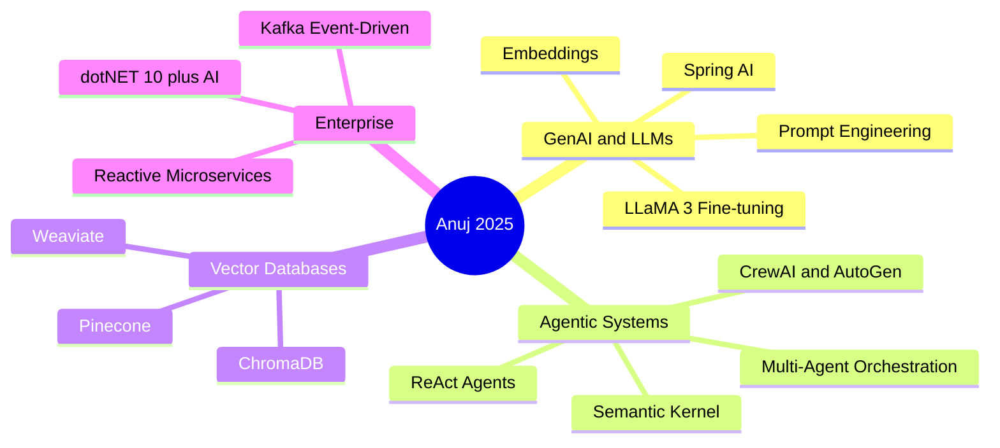

<!-- ═══════════════════════════════════════════════════════════════ -->
<!--                     HEADER BANNER                             -->
<!-- ═══════════════════════════════════════════════════════════════ -->


<div align="center">

[](https://github.com/veenuj)

<br/>

[](https://www.linkedin.com/in/anuj-dhiman3112/)
[](https://anujdhiman.netlify.app/)
[](mailto:dhimananuj123@gmail.com)
[](https://twitter.com/ig_euroanuj)
[](https://www.instagram.com/anujdhiman.ad92/)

<br/>

[](https://github.com/veenuj)
[](https://github.com/veenuj?tab=followers)
[](https://github.com/veenuj)
[](https://app.netlify.com/sites/anujdhiman/deploys)

</div>

---

<!-- ═══════════════════════════════════════════════════════════════ -->
<!--                       WHO AM I                                -->
<!-- ═══════════════════════════════════════════════════════════════ -->

<div align="center">

## 👨‍💻 `whoami`

</div>

```yaml
╔══════════════════════════════════════════════════════════════════╗
║                    ANUJ DHIMAN — PROFILE                        ║
╠══════════════════════════════════════════════════════════════════╣
║  Role        : Senior Full Stack & AI Engineer                  ║
║  Company     : Axis Bank → Freelance AI/ML (2025–Present)       ║
║  Location    : Meerut, Uttar Pradesh, India 🇮🇳                  ║
║  Experience  : 6+ Years in Enterprise Software Engineering       ║
║  Education   : BCA – CCS University                             ║
╠══════════════════════════════════════════════════════════════════╣
║  🔭 Building   → Agentic AI, RAG Pipelines, Multi-Agent Systems ║
║  🌱 Exploring  → LLaMA Fine-tuning, CrewAI, Semantic Kernel     ║
║  💡 Philosophy → "I build Agents that work for me!"             ║
╚══════════════════════════════════════════════════════════════════╝
```

<div align="center">

> *"I don't just build applications — I engineer intelligent agents that scale with your business."*

</div>

---

<!-- ═══════════════════════════════════════════════════════════════ -->
<!--                   GITHUB TROPHIES                             -->
<!-- ═══════════════════════════════════════════════════════════════ -->

<div align="center">

## 🏆 GitHub Trophies

[](https://github.com/ryo-ma/github-profile-trophy)

</div>

---

<!-- ═══════════════════════════════════════════════════════════════ -->
<!--                  ENGINEERING PHILOSOPHY                        -->
<!-- ═══════════════════════════════════════════════════════════════ -->

<div align="center">

## ⚙️ Engineering Philosophy

| 🤖 Intelligent Automation | 🏗️ Scalable Architecture | 💼 Business Impact |
|:---:|:---:|:---:|
| I build **Agents**, not just code. GenAI-powered automation for complex workflows & intelligent decisions | Battle-tested **Microservices** & **Event-Driven Systems** using Spring Boot, Kafka & cloud-native patterns | Bridging **Business Requirements** with **Tech Execution** to ship profitable, measurable ROI |

</div>

---

<!-- ═══════════════════════════════════════════════════════════════ -->
<!--                      TECH STACK                               -->
<!-- ═══════════════════════════════════════════════════════════════ -->

<div align="center">

## 🧠 GenAI · AI / ML Arsenal


<br/>

[](https://skillicons.dev)

---

## 💻 Full Stack · Enterprise Architecture

[](https://skillicons.dev)

---

## ☁️ DevOps · Cloud · Tools

[](https://skillicons.dev)

</div>

---

<!-- ═══════════════════════════════════════════════════════════════ -->
<!--                   WORK EXPERIENCE                             -->
<!-- ═══════════════════════════════════════════════════════════════ -->

<div align="center">

## 💼 Work Experience

</div>

```
┌─────────────────────────────────────────────────────────────────┐
│  2025 – Present  │  AI & Full Stack Developer  │  Freelance      │
│  ─────────────────────────────────────────────────────────────  │
│  Multi-Agent Systems, RAG pipelines with Llama & Vector DBs,    │
│  fine-tuning LLMs on domain datasets, Transformers for          │
│  predictive modeling                                            │
│  🔧 Python · LangChain · LlamaIndex · Spring AI · OpenAI API   │
└─────────────────────────────────────────────────────────────────┘
┌─────────────────────────────────────────────────────────────────┐
│  2023 – 2025  │  Deputy Manager – IT  │  Axis Bank 🏦           │
│  ─────────────────────────────────────────────────────────────  │
│  Full Stack Java Developer & Business Analyst on enterprise     │
│  banking systems. Built REST APIs, created SOPs on Confluence,  │
│  mentored 10+ engineers                                         │
│  🔧 Java · Spring Boot · ReactJS · MongoDB · Kotlin · Jenkins  │
└─────────────────────────────────────────────────────────────────┘
┌─────────────────────────────────────────────────────────────────┐
│  2022 – 2023  │  Software Dev Engineer  │  NIIT – Axis Bank     │
│  ─────────────────────────────────────────────────────────────  │
│  Completed 121 hands-on projects. Built a full functional       │
│  replica of the Axis Bank Portal                                │
│  🔧 Java · Spring MVC · Hibernate · MySQL                      │
└─────────────────────────────────────────────────────────────────┘
┌─────────────────────────────────────────────────────────────────┐
│  2020 – 2022  │  IT Manager & Business Analyst  │  HIN E-Waste  │
│  ─────────────────────────────────────────────────────────────  │
│  Managed IT infrastructure, built billing software in ASP.NET,  │
│  aligned IT strategy with business objectives                   │
└─────────────────────────────────────────────────────────────────┘
┌─────────────────────────────────────────────────────────────────┐
│  2018 – 2020  │  Senior Web Developer  │  ISAP Technologies     │
│  ─────────────────────────────────────────────────────────────  │
│  Led 4-member team, requirement gathering, promoted to Senior   │
│  Developer within 2 months based on performance                 │
└─────────────────────────────────────────────────────────────────┘
```

---

<!-- ═══════════════════════════════════════════════════════════════ -->
<!--                    FEATURED PROJECTS                          -->
<!-- ═══════════════════════════════════════════════════════════════ -->

<div align="center">

## 🚀 Featured Projects

</div>

### 🤖 AI & Multi-Agent Systems

| Project | Stack | Description | Status |
|---------|-------|-------------|--------|
| **⚡ Oracle AI Core — SALES.ERP** |     | AI-powered Sales ERP with Oracle AI Core, speech-to-action automation & intelligent business analytics | 🟢 Live |
| **🤖 AI Multi-Agent System** |     | Autonomous multi-agent orchestration system with CrewAI & LangChain for complex task automation | 🔵 In Dev |
| **🏫 SchoolERP V2** |     | Full ERP for schools powered by Gemini AI + Semantic Kernel for intelligent admin automation | 🔒 Private |

### 🏦 Banking & Fintech

| Project | Stack | Description | Status |
|---------|-------|-------------|--------|
| **🏦 Axis Bank Portal Replica** |     | Enterprise-grade full-stack banking portal simulation with secure auth, transactions & admin dashboard | ✅ Done |
| **⚛ Modern Banking Interface** |    | Modern SPA banking UI built in React with hooks, responsive design & smooth UX flows | ✅ Done |

### 🛒 Full-Stack Web Applications

| Project | Stack | Description | Links |
|---------|-------|-------------|-------|
| **📊 CRM & ERP System** |    | Comprehensive resource planning for managing inventory, sales & customer pipelines | [Repo →](https://github.com/veenuj) |
| **🛒 E-Commerce Platform** |    | Full-featured e-commerce site with MVC architecture, product management & checkout | [Repo →](https://github.com/veenuj/E_Comm_web) |
| **🛍️ DigiShop** |    | Feature-rich frontend storefront with cart, product catalog & checkout flow | [⭐ 4](https://github.com/veenuj/digi_shop) |
| **📚 Book E-Store** |   | Online bookstore with category browsing, search & purchase simulation | [⭐ 3](https://github.com/veenuj/book_estore) |
| **🌿 Lawn Care Web** |   | Business landing page for a lawn care service company | [⭐ 4](https://github.com/veenuj/Lawn_Care_web) |
| **🛒 Shop Cart** |   | Interactive shopping cart with dynamic add/remove & price calculation | [⭐ 4](https://github.com/veenuj/Shop_Cart) |
| **🏢 ISAP Technology Website** |   | Corporate website built for ISAP Technologies during senior dev tenure | [⭐ 3](https://github.com/veenuj/isapTechnology) |

---

<!-- ═══════════════════════════════════════════════════════════════ -->
<!--                    CERTIFICATIONS                             -->
<!-- ═══════════════════════════════════════════════════════════════ -->

<div align="center">

## 🎓 Certifications

| 🏅 Certificate | 🏢 Issuer | 🏷️ Domain |
|:---:|:---:|:---:|
| **GenAI & Multi-Agent Systems** | Coding Ninjas | 🤖 AI & Agents |
| **Business Intelligence** | Google | 📊 Data & Analytics |
| **Data Models & Pipelines** | Google | 🔄 Data Engineering |
| **Arrays & Structures** | Duke University | 💻 Computer Science |
| **SAP S/4HANA Professional** | SAP | 🏭 Enterprise ERP |

</div>

---

<!-- ═══════════════════════════════════════════════════════════════ -->
<!--                    GITHUB STATS                               -->
<!-- ═══════════════════════════════════════════════════════════════ -->

<div align="center">

## 📊 GitHub Statistics


<br/>


<br/>


</div>

---

<!-- ═══════════════════════════════════════════════════════════════ -->
<!--                   CURRENTLY LEVELING UP                       -->
<!-- ═══════════════════════════════════════════════════════════════ -->

<div align="center">

## 🌱 Currently Leveling Up

</div>



---

<!-- ═══════════════════════════════════════════════════════════════ -->
<!--                   RANDOM DEV QUOTE                            -->
<!-- ═══════════════════════════════════════════════════════════════ -->

<div align="center">

## 💭 Dev Wisdom

[](https://github.com/piyushsuthar/github-readme-quotes)

</div>

---

<!-- ═══════════════════════════════════════════════════════════════ -->
<!--                    CONNECT SECTION                            -->
<!-- ═══════════════════════════════════════════════════════════════ -->

<div align="center">

## 📫 Let's Build Something Extraordinary

*Open to collaborations, freelance projects & full-time opportunities in AI/ML and Full Stack Engineering*

<br/>

[](https://www.linkedin.com/in/anuj-dhiman3112/)
[](https://anujdhiman.netlify.app/)
[](mailto:dhimananuj123@gmail.com)
[](https://twitter.com/ig_euroanuj)
[](https://www.instagram.com/anujdhiman.ad92/)

</div>

<!-- ═══════════════════════════════════════════════════════════════ -->
<!--                     FOOTER BANNER                             -->
<!-- ═══════════════════════════════════════════════════════════════ -->


